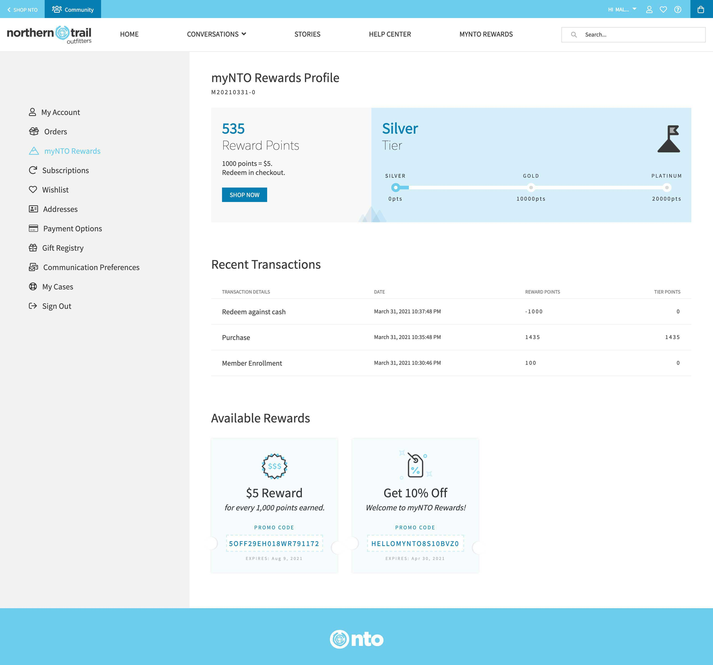
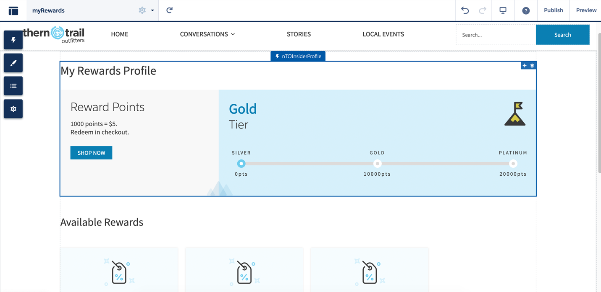
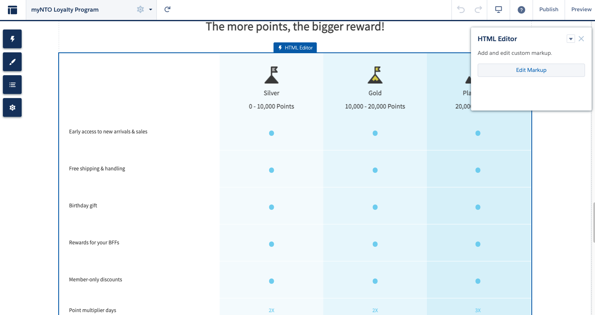
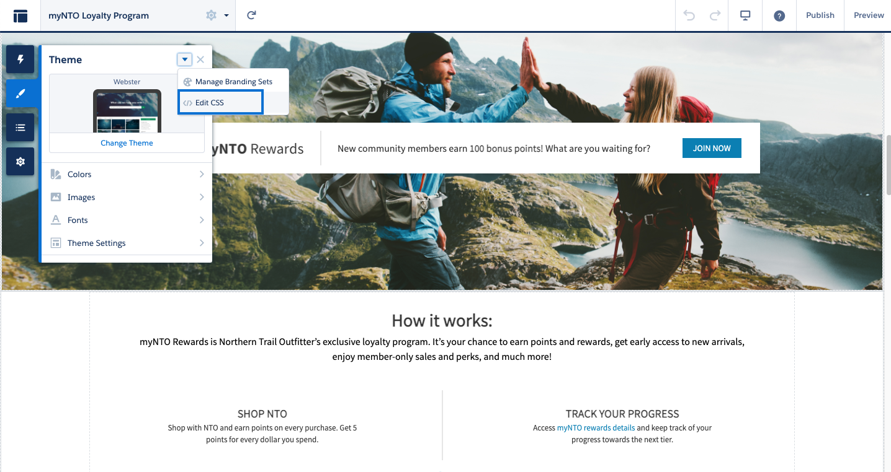

<div>
	
</div>

# _[B2C Loyalty Management Coomponents](https://github.com/sfdc-qbranch/B2C-Loyalty-Mgmt-Components)_

#### _Show off a loyalty dashboard with points, transactions and vouchers inside your Customer Community_

#### Checkout the entire project on <a href="https://solutionscentral.io/posts/0aeb1780-9220-11eb-82b4-9ff704cabaaf/b2c-loyalty-management-demo-guide-in-autonto/">Solutions Central</a>

<h4 align="center">
	<a href="#features">Features</a> |
	<a href="#getting-started">Getting Started</a> |
	<a href="#usage">Usage</a> |
	<a href="#faqs">FAQs</a> |
	<a href="#documentation">Documentation</a> |
	<a href="#contributing">Contributing</a> |
	<a href="#acknowledgements">Acknowledgements</a> 🥰
</h4>

<p align="center">
	
</p>

---

## Features

Use this highly customisable component to show a connected customer experience through engagement and loyalty. 

- The **LWCs** (force-app) demos a member portal to track points and rewards. These are meant to be shown on a customer community once you have Loyalty Management setup in your org. 

- The **ExperienceBuilder components** can be added to any customer community page - with or without Loyalty Management turned on. 

- myRewards_Static has the same content as the LWC but static
- Rewards_About is a loyalty program about page (filled with so much fun content!)
- Rewards_Banner is a Splash Banner with call to action to "Join"

## Getting Started

### Prerequisites

There are a few items you need to setup before installing:

1. You will need to have Loyalty Management working in your org for the Sandbox LWCs to work correctly. 
2. If you do not have Loyalty Management in your org, please create 4 new objects using the data in the objects folder. 

### Install

Deploy the source:

1. Clone this repository:

```
git clone git@github.com:sfdc-qbranch/B2C-Loyalty-Mgmt-Components.git
cd B2C-Loyalty-Mgmt-Components
```

2. Authorize with your org and provide it with an alias (OrgAlias):

```
sfdx force:auth:web:login -a "OrgAlias"
```

3. Push the app to your org:

```
sfdx force:source:deploy --sourcepath force-app/main/default --json --loglevel fatal --targetusername "OrgAlias"
```

4. Open the default org:

```
sfdx force:org:open --targetusername "OrgAlias"
```

## Usage

There are 5 Lightning Components & 3 Apex Classes included in the NTO Rewards Portal:
- **[NTO Rewards Portal](#NTO Rewards Portal)** 

There are 3 static Experience Builder Components
- **[Static Experience Builder](#Static Experience Builder)** 

### NTO Rewards Portal

#### Adding NTO Rewards Portal to your org:

Ensure your community user has access to following Apex Classes

- MemberProfile.cls
- NTOProfilePointsController.cls
- NTOVouchersController.cls

---

Once that is complete, drag the **nTOInsiderProfile** and **nTOVoucher** to your Experience Builder Page.

<div>
	
</div>


### Static Experience Builder

#### Adding Static Experience Builder to your community

If you still want to demo loyalty but don't have Loyalty Management set up in your org, you can still paste this static component to your Community!

Copy and Paste the HTML from the body of myRewards_Static.html in an HTML Component in Experience Builder. Then copy the CSS from the header into CSS Overides. 

Every Loyalty program has a strong "About" page! Use the content in Rewards_About folder to help build out your pages. 

Copy and Paste the HTML from the body of the html files in an HTML Component in Experience Builder. Then copy the CSS from the header into CSS Overides. 

<div>
	
</div>

<div>
	
</div>

---


## Documentation

Read the [Demo Guide][https://solutionscentral.io/posts/0aeb1780-9220-11eb-82b4-9ff704cabaaf/b2c-loyalty-management-demo-guide-in-autonto/] for external documentation on Loyalty Management.
Checkout the [Sketch File][https://drive.google.com/open?id=17U5ygdgHrVq5LoHDjabrem8JWnnDV2Jr] for mockups.

## FAQs

#### Does it work in Communities?

> Yes!

#### Does it work in Mobile?

> Yes!

#### Does it work with Person Accounts?

> Yes!

#### Others?


## Acknowledgements

Special thanks to:

- Q Branch for your continued support.
- Everyone that has requested for, used and provided feedback on this project.

## License

[![License][license-shield]][license-url] Copyright © 2020 [Q Branch][author-url]

<!--- Images -->

[license-shield]: https://img.shields.io/badge/License-BSD%203--Clause-blue.svg

<!--- Urls -->

[repository-url]: https://github.com/sfdc-qbranch/B2C-Loyalty-Mgmt-Components
[license-url]: http://opensource.org/licenses/BSD-3-Clause
[author-url]: https://github.com/jmcconoghy
[quip-url]: https://solutionscentral.io/posts/0aeb1780-9220-11eb-82b4-9ff704cabaaf/b2c-loyalty-management-demo-guide-in-autonto/
